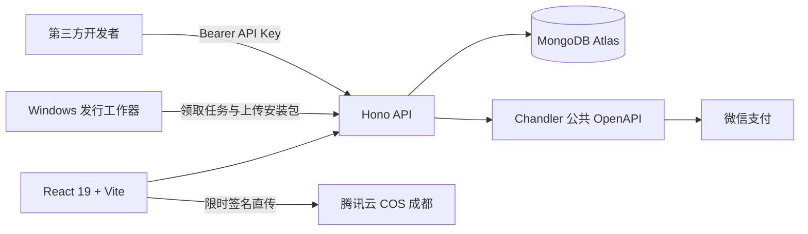

# 古龙 Gulong Agent Engine 官方平台

古龙桌面端智能体引擎的官网、用户中心与开放平台。项目同时提供浅色高端营销首页、可切换主题、账号与 API Key、软件下载、第二大脑 ZIP 上传、图文反馈、充值/订阅，以及可在线浏览的 OpenAPI 文档。


## 已实现

- 玉瓷、日出、青竹、鸢尾 4 套可持久化浅色主题，并配有独立 3D 圆形徽章
- Chandler v3.7 公共 OpenAPI 统一账号：官网开放邮箱注册，已激活桌面客户端支持手机号注册；支持用户名/邮箱密码登录、6 位邮箱/短信验证码登录和邮箱/手机找回密码，官网不保存密码
- 用户后台“账号安全”支持验证邮箱、绑定/验证/解绑手机号；手机号仅服务于既有邮箱账号，验证码采用 60 秒冷却、IP 与目标摘要双重限流和固定响应防枚举
- Chandler 全局账号可在古龙桌面端、永生花桌面端与官网交叉登录；官网注册默认标记为“古龙版”
- 用户后台明确区分“管理员/会员用户/普通用户”和“古龙版/永生花版”，管理员身份不会再被会员状态覆盖
- 普通用户后台：第二大脑处理进度与反馈、会员与余额、订单、账号安全、个人资料和共享节点收益
- 全站正文以 18px 为最低字号，账户侧栏、表格、表单和说明文字统一按可读性基线校正
- 旧官网账号首次 Chandler 登录时按已验证邮箱安全归并，保留历史上传、订单、API Key 与反馈
- Chandler 离线权益凭据：RS256 JWT、JWKS 离线验签与可选设备绑定
- 每位开发者最多 10 个可撤销 API Key，按 scope 授权
- MiniMax API Key 使用 AES-256-GCM 加密保存；桌面端可通过 `configuration:read` 独立权限读取自己的配置
- 智能体任务、任务状态、第二大脑记忆、可搜索工作流目录与管理员工作流管理（图片直传 COS）
- Scalar 在线接口文档与 OpenAPI 3.1 JSON
- 合作伙伴管理、自动生成 SVG Logo、首页品牌墙与安全官网跳转
- “主题访问权限”用户分组自动同步为发行渠道，后台一键发版，每个渠道只保留最新版
- 腾讯云 COS 存储第二大脑 ZIP 和 Windows 安装包；MongoDB 提供关键词/日期检索索引
- 第二大脑附件后台列表、手动下载及按日期拉取最新附件 API
- 文字反馈与最多 9 张问题截图
- Chandler v3.7 微信收银台、单次充值、自定义金额订单、月/年手动续费，以及线下支付申请与管理员确认到账
- 独立“短视频包月”用户类型：月付 5999 元、年付 59999 元，线下审核到账后实付多少、余额到账多少，不额外赠送；有效期内 MiniMaxH3 额度用完仍可无限生成，零扣费阶段不产生分佣
- 古龙网页版 MiniMaxH3共享节点支持 9 张图片、3 个视频、3 个音频直传腾讯云 COS；素材自动编号并可在提示词中用 `@图片1`、`@视频1`、`@音频1` 精确引用；“时长”后的魔法图标允许用户自主决定是否由桌面节点执行本地提示词优化
- 官网后台通过 `Authorization: Apikey` 服务端凭据直连 Chandler v3.7 合作伙伴接口：用户同步、订阅查看、应用级 SKU 与不可变价格版本发布和历史查询
- 下载中心的高性能桌面产品对外展示为“MiniMax H3 极速视频版”；内部继续使用兼容的 `yongshenghua` 发行键，避免已有渠道、账号和安装包映射失效
- 管理员实时数据看板：7/30/90 天用户增长、访问来源、激活漏斗、功能采用、任务与第二大脑运营、收入结构和自动经营洞察
- 官网访问、软件下载和发起支付采用匿名访客/会话 ID 做最小化埋点；登录用户活跃数据来自服务端会话，不采集页面输入内容
- MongoDB Atlas 索引、会话 TTL、限流 TTL、连接池复用

## 技术架构



- 前端：React 19、Vite 6、Phosphor Icons，静态资源可由 Vercel Edge CDN 或腾讯云 Debian 节点分发。
- 后端：Hono、Zod OpenAPI，同时发布到 Vercel Node Functions 与腾讯云 systemd 服务。
- 数据库：MongoDB Node.js 原生驱动，跨热实例复用连接池。
- 文件：腾讯云 COS 私有对象，服务端签发短时 PUT/GET URL；MongoDB 只保存所有权、状态与搜索元数据。反馈截图仍可使用 Vercel Blob。
- 安全：Chandler 统一身份；服务端优先读取 `GulongAgent` 环境变量作为 Chandler v3.7 API Key，并使用 `Authorization: Apikey`；桌面手机号注册 OAuth 密钥仅保存在服务端；支付通知按原始请求体执行 HMAC-SHA256 验签并二次查询订单；浏览器只接收微信预支付结果，永不接触平台密钥。另有 HttpOnly 会话、API Key 摘要、来源校验、验证码防轰炸限流与最小权限 CAM。

## 本地开发

```bash
npm install
copy .env.example .env.local
npm run dev:api
npm run dev
```

前端默认运行在 `http://127.0.0.1:5173`，API 默认运行在 `http://127.0.0.1:8787`。Vite 会把 `/api` 代理到本地 API。

## 环境变量

复制 `.env.example` 并按部署环境配置。敏感值只能存放在 Vercel Environment Variables 或本地未提交的环境文件中。

- `MONGODB_URI` / `MONGODB_DB`：MongoDB Atlas
- `SESSION_SECRET` / `API_KEY_PEPPER`：会话与 API Key 摘要密钥
- `SESSION_COOKIE_SECURE`：通常留空，由反向代理协议自动决定；仅在临时 HTTP 直连环境显式设为 `false`，正式域名必须使用 HTTPS
- `GulongAgent` / `CHANDLER_*`：Chandler v3.7 API Key、OAuth 客户端密钥、API 地址、古龙/永生花应用 ID 与当前价格版本
- `TENCENT_SECRET_ID` / `TENCENT_SECRET_KEY`：仅授予目标 Bucket 所需操作的 CAM 子账号密钥
- `COS_BUCKET` / `COS_REGION` / `COS_DOMAIN`：`gulong-1259744534`、`ap-chengdu` 与请求域名
- `RELEASE_WORKER_KEY`：官网与受信任 Windows 发行工作器共享的长随机密钥
- `BLOB_READ_WRITE_TOKEN`：仅用于问题反馈截图

支付商户参数、订阅、余额和权益由 Chandler 统一管理。线下支付在 MongoDB 中保留审核队列，并将审批结果同步到 Chandler 用户扩展属性。

## API 文档

启动服务后访问：

- `/api/docs`：交互式 Scalar 文档
- `/api/openapi.json`：OpenAPI 3.1 规范
- [MiniMax H3 共享节点接入合同](docs/minimax-h3-shared-nodes.md)：桌面账号绑定、能力领取、COS 直传、回调与余额账本
- 开放接口认证：`Authorization: Bearer gla_live_...`
- 按日期下载附件：`GET /api/v1/brain/attachments/latest?date=YYYY-MM-DD`
- 桌面端用户配置：`GET /api/v1/configuration/minimax`（需要 `configuration:read`）
- 桌面端实时订阅价格：`GET /api/v1/pricing/subscriptions`（公开、禁止缓存，管理员修改后立即生效）
- 桌面端实时订阅与短视频套餐状态：`GET /api/v1/desktop/account/subscription`；`shortVideoPackage` 明确返回无限 H3、剩余额度、到期时间和扣费模式
- [桌面订阅、充值与剩余用量合同](docs/desktop-billing-integration.md)：稳定官网深链、线下充值订单、桌面刷新机制，以及 `GET /api/v1/desktop/account/usage` 的完整字段
- 登录能力：`GET /api/auth/capabilities`；发送/校验登录验证码：`POST /api/auth/otp/send`、`POST /api/auth/otp/login`
- 已激活桌面客户端手机号注册：`POST /api/v1/desktop/auth/phone/send-otp`、`POST /api/v1/desktop/auth/phone/register`（6 位验证码；OAuth 密钥只保存在官网服务端）
- 账号安全：`GET /api/account/security`；邮箱验证、手机号绑定/验证/解绑、主身份切换、修改密码与注销全部设备接口见在线 OpenAPI
- Chandler 管理接口：`/api/admin/chandler/users`、`/api/admin/chandler/catalog`、`/api/admin/chandler/prices`、`/api/admin/chandler/skus/{skuId}/prices`
- 管理员经营分析：`GET /api/admin/analytics/dashboard?days=7|30|90`（管理员会话或管理员 API Key）

完整集成边界与生产配置见 [docs/integration-deployment.md](docs/integration-deployment.md)，本次认证升级审计见 [docs/chandler-v3.7-auth-audit.md](docs/chandler-v3.7-auth-audit.md)，Windows 发行工作器说明见 [docs/release-worker.md](docs/release-worker.md)。

## 双目标生产发布

`main` 分支每次更新都会触发 `.github/workflows/deploy-production.yml`：先执行完整测试、生产构建和 Sites 产物校验，再并行发布到 Vercel Production 与腾讯云 Debian 节点。腾讯云采用 `/opt/gulong/releases/<commit>` 不可变目录和 `/opt/gulong/current` 原子软链接；新版本重启或健康检查失败时自动恢复上一版本，避免把故障版本继续暴露给用户。

部署密钥只存放在 GitHub `production` Environment / Actions Secrets，不进入 Git、构建产物或日志。首次启用需要配置的变量、环境保护和 SSH 主机指纹见 [双目标 CI/CD 部署说明](docs/production-cicd.md)。

## 验证

```bash
npm test
npm run build
```

视觉验收记录见 [design-qa.md](design-qa.md)，最终结果为 `passed`。
