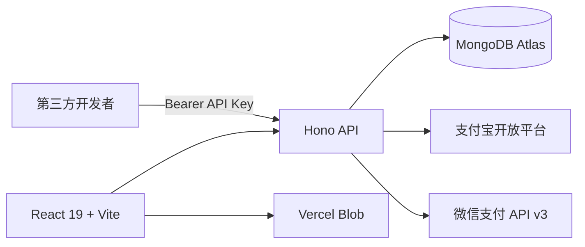

# 古龙 Gulong Agent Engine 官方平台

古龙桌面端智能体引擎的官网、用户中心与开放平台。项目同时提供浅色高端营销首页、可切换主题、账号与 API Key、软件下载、第二大脑 ZIP 上传、图文反馈、充值/订阅，以及可在线浏览的 OpenAPI 文档。


## 已实现

- 玉瓷、日出、青竹、鸢尾 4 套可持久化浅色主题，并配有独立 3D 圆形徽章
- 用户名 + 密码、邮箱 + 密码两种注册/登录方式
- 每位开发者最多 10 个可撤销 API Key，按 scope 授权
- 智能体任务、任务状态、第二大脑记忆、工作流开放接口
- Scalar 在线接口文档与 OpenAPI 3.1 JSON
- 飞书、夸克、百度网盘下载渠道，可通过环境变量或管理员接口配置
- 第二大脑 ZIP 分片直传与分析排队记录
- 文字反馈与最多 9 张问题截图
- 单次充值、月付/年付会员、到期取消、支付宝/微信支付签名与回调验证
- MongoDB Atlas 索引、会话 TTL、限流 TTL、连接池复用

## 技术架构



- 前端：React 19、Vite 6、Phosphor Icons，静态资源由 Vercel Edge CDN 分发。
- 后端：Hono、Zod OpenAPI，运行在 Vercel Node Functions。
- 数据库：MongoDB Node.js 原生驱动，跨热实例复用连接池。
- 文件：Vercel Blob 客户端分片直传，服务端签发受类型、大小与用户约束的上传令牌。
- 安全：scrypt 加盐密码、HttpOnly 会话、API Key 摘要存储、来源校验、限流、支付回调验签。

## 本地开发

```bash
npm install
copy .env.example .env.local
npm run dev:api
npm run dev
```

前端默认运行在 `http://127.0.0.1:5173`，API 默认运行在 `http://127.0.0.1:8787`。Vite 会把 `/api` 代理到本地 API。

## 环境变量

复制 `.env.example` 并按部署环境配置。敏感值只能存放在 Vercel Environment Variables 或本地未提交的环境文件中。

- `MONGODB_URI` / `MONGODB_DB`：MongoDB Atlas
- `SESSION_SECRET` / `API_KEY_PEPPER`：会话与 API Key 摘要密钥
- `BLOB_READ_WRITE_TOKEN`：Vercel Blob
- `PAYMENT_MODE`：`mock` 或 `live`
- `ALIPAY_*`：支付宝 RSA2 应用、商户私钥、平台公钥与回调
- `WECHATPAY_*`：微信支付 API v3 商户、证书、私钥与回调
- `DOWNLOAD_*`：飞书、夸克与百度网盘链接

真实自动续订需分别开通支付宝周期扣款和微信委托代扣产品，并补充渠道签约参数。未配置商户凭证时应保持 `PAYMENT_MODE=mock`，不会产生真实扣款。

## API 文档

启动服务后访问：

- `/api/docs`：交互式 Scalar 文档
- `/api/openapi.json`：OpenAPI 3.1 规范
- 开放接口认证：`Authorization: Bearer gla_live_...`

## 验证

```bash
npm test
npm run build
```

视觉验收记录见 [design-qa.md](design-qa.md)，最终结果为 `passed`。
