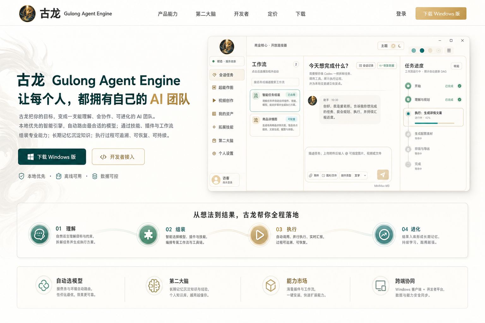
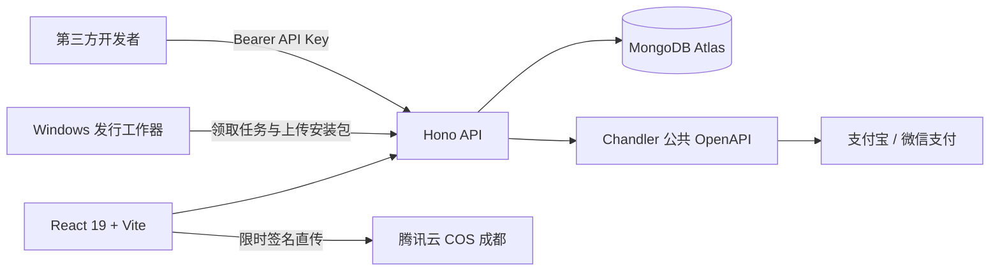

# 古龙 Gulong Agent Engine 官方平台

古龙桌面端智能体引擎的官网、用户中心与开放平台。项目同时提供浅色高端营销首页、可切换主题、账号与 API Key、软件下载、第二大脑 ZIP 上传、图文反馈、充值/订阅，以及可在线浏览的 OpenAPI 文档。



## 已实现

- 玉瓷、日出、青竹、鸢尾 4 套可持久化浅色主题，并配有独立 3D 圆形徽章
- Chandler 公共 OpenAPI 统一账号：邮箱注册，用户名/邮箱 + 密码登录，服务端自动刷新令牌，官网不保存密码
- 普通用户后台：第二大脑处理进度与反馈、会员与余额、订单、个人资料和 MiniMax 配置
- 旧官网账号首次 Chandler 登录时按已验证邮箱安全归并，保留历史上传、订单、API Key 与反馈
- Chandler 离线权益凭据：RS256 JWT、JWKS 离线验签与可选设备绑定
- 每位开发者最多 10 个可撤销 API Key，按 scope 授权
- MiniMax API Key 使用 AES-256-GCM 加密保存；桌面端可通过 `configuration:read` 独立权限读取自己的配置
- 智能体任务、任务状态、第二大脑记忆、工作流开放接口
- Scalar 在线接口文档与 OpenAPI 3.1 JSON
- 合作伙伴管理、自动生成 SVG Logo、首页品牌墙与安全官网跳转
- “主题访问权限”用户分组自动同步为发行渠道，后台一键发版，每个渠道只保留最新版
- 腾讯云 COS 存储第二大脑 ZIP 和 Windows 安装包；MongoDB 提供关键词/日期检索索引
- 第二大脑附件后台列表、手动下载及按日期拉取最新附件 API
- 文字反馈与最多 9 张问题截图
- Chandler 微信/支付宝收银台、单次充值、月/年订阅、线下支付申请与管理员确认到账
- 官网后台直连 Chandler 管理接口：用户搜索、账号冻结/恢复、订阅查看、权益双人审批与不可变价格版本发布
- MongoDB Atlas 索引、会话 TTL、限流 TTL、连接池复用

## 技术架构



- 前端：React 19、Vite 6、Phosphor Icons，静态资源由 Vercel Edge CDN 分发。
- 后端：Hono、Zod OpenAPI，运行在 Vercel Node Functions。
- 数据库：MongoDB Node.js 原生驱动，跨热实例复用连接池。
- 文件：腾讯云 COS 私有对象，服务端签发短时 PUT/GET URL；MongoDB 只保存所有权、状态与搜索元数据。反馈截图仍可使用 Vercel Blob。
- 安全：Chandler 统一身份、加密保存的服务端令牌、HttpOnly 会话、API Key 摘要、来源校验、限流与最小权限 CAM。

## 本地开发

```bash
npm install
copy .env.example .env.local
npm run dev:api
npm run dev
```

前端默认运行在 `http://127.0.0.1:5173`，API 默认运行在 `http://127.0.0.1:8787`。Vite 会把 `/api` 代理到本地 API。

## 环境变量

复制 `.env.example` 并按部署环境配置。敏感值只能存放在 Vercel Environment Variables 或本地未提交的环境文件中。

- `MONGODB_URI` / `MONGODB_DB`：MongoDB Atlas
- `SESSION_SECRET` / `API_KEY_PEPPER`：会话与 API Key 摘要密钥
- `CHANDLER_*`：Chandler API 地址、古龙应用 ID 与当前价格版本
- `TENCENT_SECRET_ID` / `TENCENT_SECRET_KEY`：仅授予目标 Bucket 所需操作的 CAM 子账号密钥
- `COS_BUCKET` / `COS_REGION` / `COS_DOMAIN`：`gulong-1259744534`、`ap-chengdu` 与请求域名
- `RELEASE_WORKER_KEY`：官网与受信任 Windows 发行工作器共享的长随机密钥
- `BLOB_READ_WRITE_TOKEN`：仅用于问题反馈截图
- `DOWNLOAD_*`：飞书、夸克与百度网盘链接

支付商户参数、订阅、余额和权益由 Chandler 统一管理。线下支付在 MongoDB 中保留审核队列，并将审批结果同步到 Chandler 用户扩展属性。

## API 文档

启动服务后访问：

- `/api/docs`：交互式 Scalar 文档
- `/api/openapi.json`：OpenAPI 3.1 规范
- 开放接口认证：`Authorization: Bearer gla_live_...`
- 按日期下载附件：`GET /api/v1/brain/attachments/latest?date=YYYY-MM-DD`
- 桌面端用户配置：`GET /api/v1/configuration/minimax`（需要 `configuration:read`）
- Chandler 管理接口：`/api/admin/chandler/users`、`/api/admin/chandler/catalog`、`/api/admin/chandler/prices`

完整集成边界与生产配置见 [docs/integration-deployment.md](docs/integration-deployment.md)，Windows 发行工作器说明见 [docs/release-worker.md](docs/release-worker.md)。

## 验证

```bash
npm test
npm run build
```

视觉验收记录见 [design-qa.md](design-qa.md)，最终结果为 `passed`。
