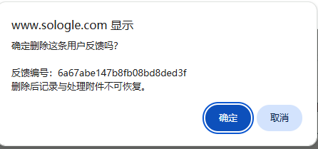
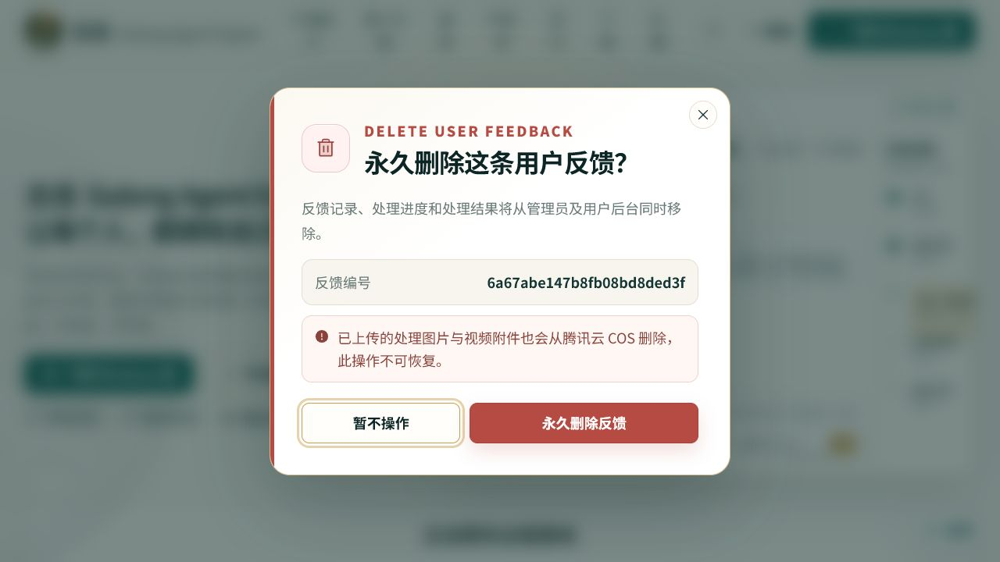

# 全站确认弹窗审查与改造

## 审查范围

管理员后台用户反馈删除，以及代码中所有会触发浏览器原生 `confirm` 的高影响操作。

## 用户目标与可访问性目标

用户需要在执行删除、冻结、授权、到账审核、停止续订或结算前，清楚看懂操作对象、后果与是否可恢复；同时可用键盘安全取消，不因浏览器样式差异降低辨识度。

## 1. 改造前：浏览器原生确认框

状态：需要改进。

- 标题被浏览器固定为域名提示，无法表达操作层级。
- 风险、反馈编号和操作后果混在连续正文中，阅读层次弱。
- 按钮文案只有“确定 / 取消”，无法说明实际结果。
- 样式不跟随古龙主题，也无法统一移动端布局和动效。

## 2. 改造后：古龙统一确认弹窗

状态：健康。

- 使用标题、说明、操作对象、不可恢复提示和明确按钮建立完整层级。
- 删除操作采用克制的危险色，取消按钮默认获得焦点，降低误删概率。
- 支持背景点击、关闭按钮与 `Esc` 取消；使用 `alertdialog`、`aria-modal`、标题和说明关联。
- 适配四套浅色主题、移动端单列按钮和减少动态效果偏好。

## 全站检查结果

共发现并替换 8 处浏览器原生确认交互：用户反馈删除、合作伙伴删除、账号冻结/恢复、管理员授权、威客到账审核、线下订单到账、威客验收结算、MiniMax 配置删除、停止自动续订。项目规则已明确禁止继续使用浏览器原生 `alert / confirm / prompt`。

## 证据范围

改造前截图来自用户提供的真实管理员反馈删除流程；改造后截图使用本地真实组件与同一反馈编号完成视觉和焦点验证。管理员登录后的真实删除请求未在审查中提交，以避免删除用户数据；接口和调用链由自动化测试覆盖。
